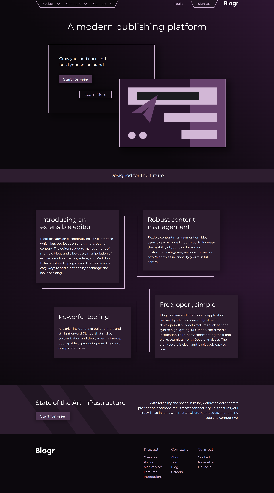

# Frontend Mentor - Blogr landing page solution

This is a solution to the [Blogr landing page challenge on Frontend Mentor](https://www.frontendmentor.io/challenges/blogr-landing-page-EX2RLAApP). Frontend Mentor challenges help you improve your coding skills by building realistic projects.

## Table of contents

-   [Overview](#overview)
    -   [The challenge](#the-challenge)
    -   [Screenshot](#screenshot)
    -   [Links](#links)
-   [My process](#my-process)
    -   [Built with](#built-with)
    -   [What I learned](#what-i-learned)
    -   [Continued development](#continued-development)
    -   [Useful resources](#useful-resources)
-   [Author](#author)

## Overview

### The challenge

Users should be able to:

-   View the optimal layout for the site depending on their device's screen size
-   See hover states for all interactive elements on the page

### Screenshot

### Links

-   [Solution URL](https://github.com/c0dehamster/blogr-landing-page-redesign)
-   [Live Site URL](https://blogr-landing-page-redesign.vercel.app/)

## My process

### Built with

-   Semantic HTML5 markup
-   CSS custom properties
-   Flexbox
-   CSS Grid
-   Mobile-first workflow
-   [Svelte](https://svelte.dev/) - JS framework
-   Typescript
-   [Figma](https://www.figma.com/) - Online design tool

### What I learned

This is my first attempt to re-design a web page. I kept the structure of the copy the same, with the exception of the CTA section, but changed the layout, the color scheme and illustrations. The new design required some techniques that were new for me.

I used Figma as my design tool. I had worked with it before, but for this project I had to learn it in more detail.

The header of the page has a few non-square elements that required to use the clip-path property. To avoid clipping the borders and all the elements that extend outside their parents, I used the property on dummy background divs instead of the oddly shaped elements themselves.

This project made me really appreciate display: grid as a tool for positioning and overlapping elements. The entire hero section is made with grid.

I used Svelte transition to animate expandable sections of the navigation menu. Svelte provides a variety of built-in transitions and animations that make creating widgets like accordions easier than it is with CSS.

### Continued development

I don't have any considerable understanding of design. Working on this project, I had difficulties with basically every aspect of it, such as wireframing, layout, color choices etc. If I am going to be designing sites or even re-designing other Frontend Mentor challenges, I will have to study each of these topics.

### Useful resources

-   [Dribbble](https://dribbble.com/) provides a collection of design examples. I used some of them as inspiration
-   [Planning and wireframing a landing page](https://youtu.be/iu4utTIrCI8) - a guide to the initial stage of the designing process by CharlieMarieTV

## Author

-   Frontend Mentor - [@twDevNoob](https://www.frontendmentor.io/profile/twDevNoob)
